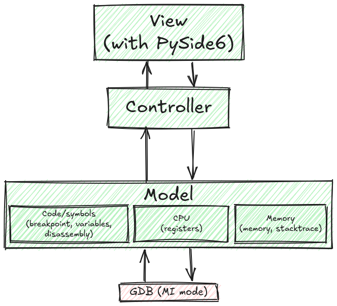

# SideGDB

a custom GDB UI made in Python.

## ⚠️⚠️ THIS IS ALPHA SOFTWARE ⚠️⚠️
Parts of this project could be rewritten when you least expect it: this documentation can get outdated very easily.

# How does it work??

This is an oversimplified view of the program. Pretty much, you click buttons and it sends commands to the GDB instance that's debugging your target. 

  
# VERY IMPORTANT NOTE

this program was made with OSDev in mind, i made it so that i could debug [my kernel](https://github.com/purpleK2/kernel) with something other than VSCode's debugger. I did NOT test this with your average C program that's supposed to run on your terminal, or something like that.

# Prerequisites

You'll need these libraries:

- `pygdbmi`: [the bridge between Python and GDB](https://cs01.github.io/pygdbmi/)
- `PySide6`: [the official Python module for Qt6](https://pypi.org/project/PySide6/)

There is a `requirements.txt` if you didn't notice btw

# How to use

TODO.
