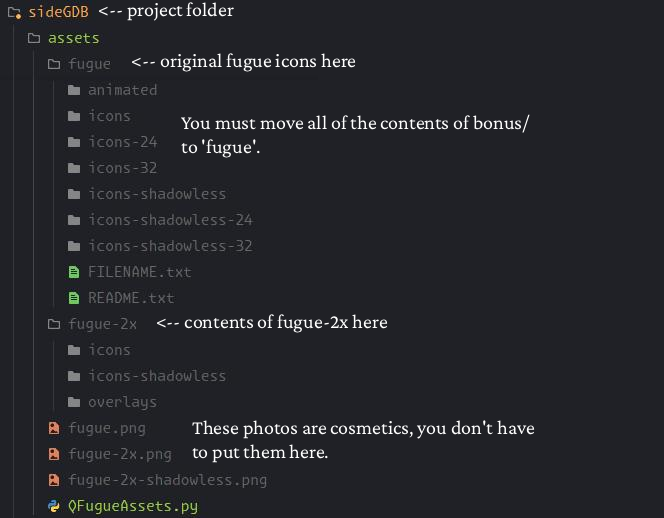

# SideGDB

a custom GDB UI made in Python.

## ⚠️⚠️ THIS IS ALPHA SOFTWARE ⚠️⚠️
Parts of this project could be rewritten when you least expect it: this documentation can get outdated very easily.
  
# VERY IMPORTANT NOTE

this program was made with OSDev in mind, i made it so that i could debug [my kernel](https://github.com/purpleK2/kernel) with something other than VSCode's debugger. I did NOT test this with your average C program that's supposed to run on your terminal, or something like that.

# Prerequisites

TODO.

# How to use

TODO.

# CREDITS

- [Fugue Icons](assets/fugue) by [Yusuke Kamiyamane](http://p.yusukekamiyamane.com/). Licensed under a Creative Commons Attribution 3.0 License.
- [Upscaled Fugue](assets/fugue-2x) by [chrisjbillington](github.com/chrisjbillington/fugue-2x-icons)

## NOTE: FUGUE ICONS ARE NOT IN THE PROJECT

you'll have to download them manually, because i don't want to commit 14k+ files lol.

You should have this setup inside the `assets` folder:

